# Отчет по обработке изображений

**Исходное изображение:** test_image.jpg
**Размер:** 600×400 пикселей

---

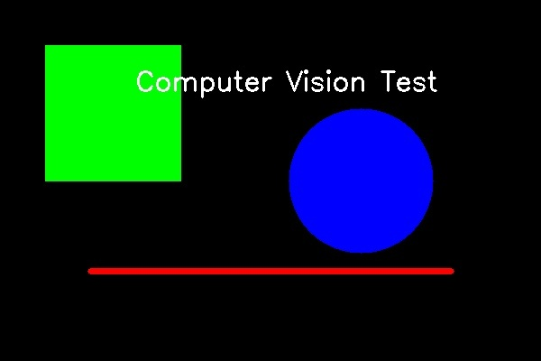
## 1. ORB Features
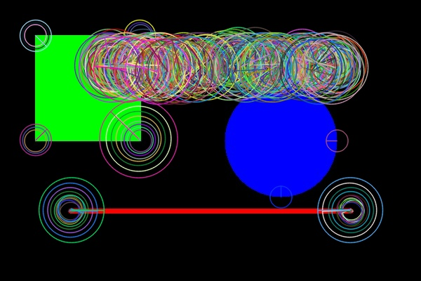
## 2. SIFT Features

## 3. Canny Edges
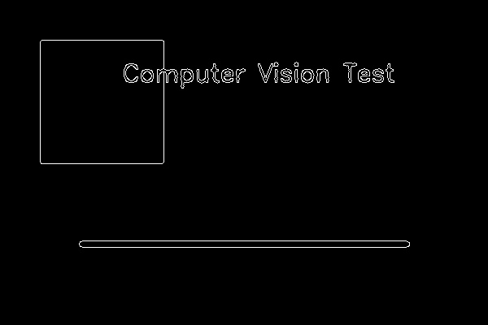
## 4. Grayscale

## 5. HSV
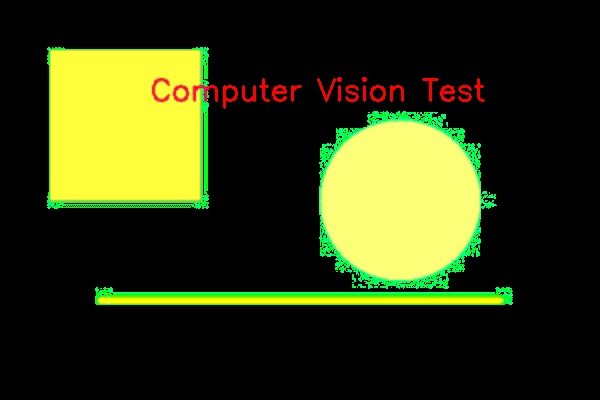
## 6. Отражение по правой границе
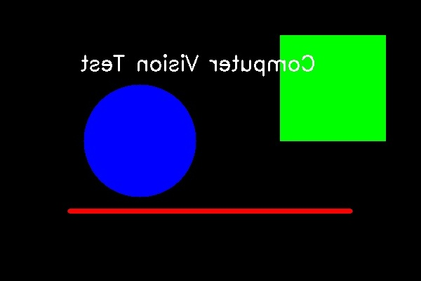
## 7. Отражение по нижней границе
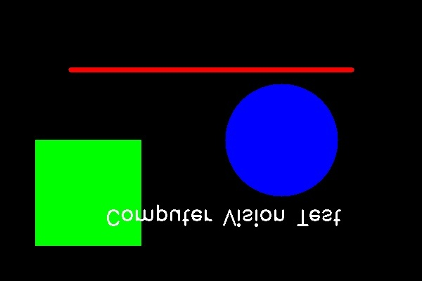
## 8. Поворот на 45°
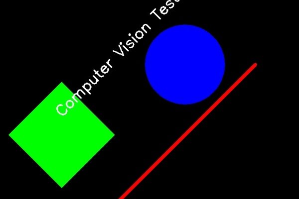
## 9. Поворот на 30° вокруг точки (150, 150)
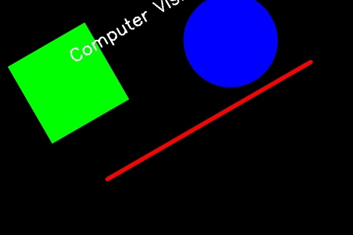
## 10. Сдвиг на 10px вправо
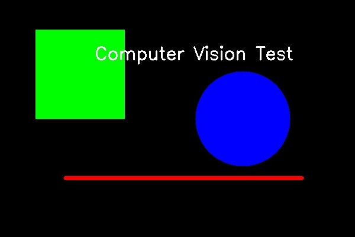
## 11. Изменение яркости
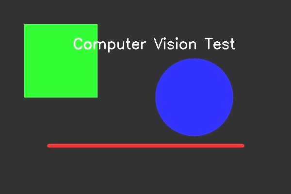
## 12. Изменение контраста

## 13. Гамма-преобразование

## 14. Гистограмная эквализация
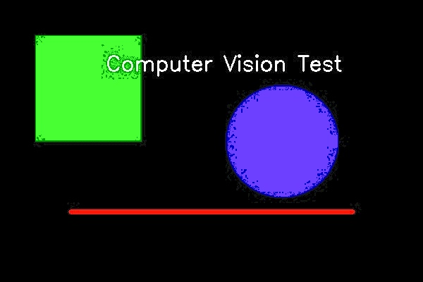
## 15. Теплый баланс белого

## 16. Холодный баланс белого

## 17. Изменение цветовой палитры: JET
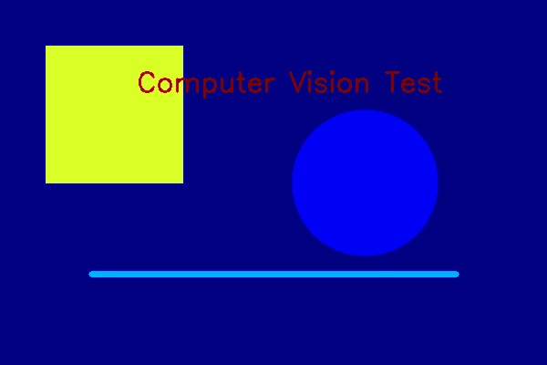
## 18. Бинаризация
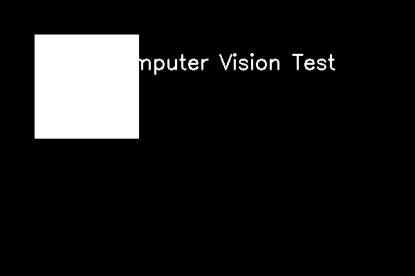
## 19. Контуры на бинаризированном изображении

## 20. Контуры с фильтрами
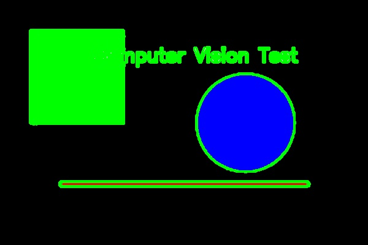
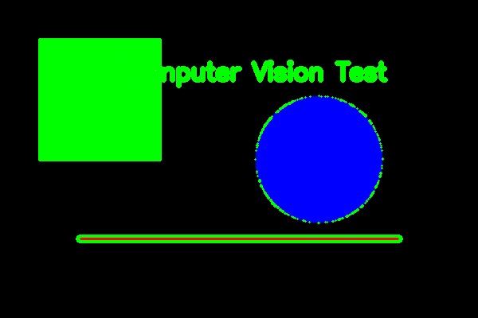
## 21. Размытие изображения: Гауссово

## 22. Фурье фильтрация: высокие частоты
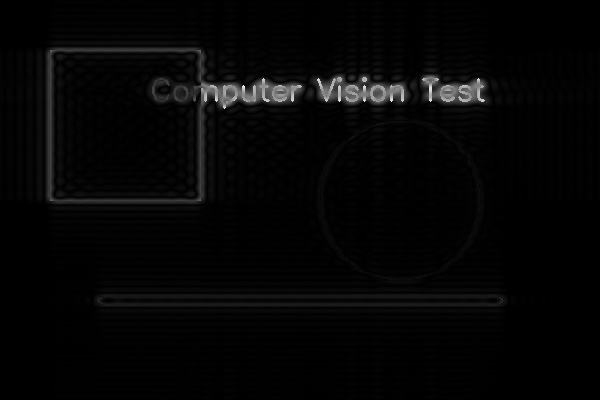
## 23. Фурье фильтрация (низкие частоты)
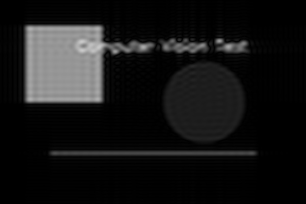
## 24. Операция эрозии
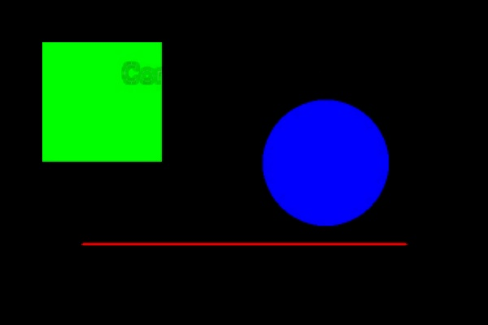
## 25. Операция дилатации
